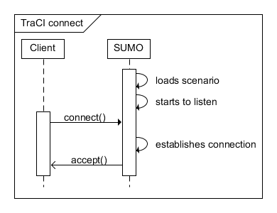

# Connecting CARLA and Artery to a shared SUMO instance

## Introduction
Since SUMO 0.30.0 it is possible to connect multiple clients to a single SUMO instance. It allows to synchronize both CARLA and Artery (Omnet++ and Vanetza), AI and V2X.

In literature we can find some papers [0] that already have an implementation of a V2X simulator playing together with CARLA. Our paper proposes an alternative way to connect both simulators abd also some results from the joint simulations.

SUMO provides a protocol called TraCI (Traffic Control Interface) [1] which, using a TCP-based architecture allows other applications to interact with SUMO. Figure 1 shows the basic flow of a TraCI connection.

 {width=50%}

Our tools fit perfectly in this use case: CARLA (client 1) allows cosimulation with SUMO [2] and Artery (client 2) can use a remote SUMO instance [3].

## Modifying source code
For SUMO to know that a client is ready it (the client) needs to send a `setOrder` command. By default, neither Artery nor CARLA do that, so some tweaks have to be done.

### Artery
Artery is programmed in C++, so we need to change the code before compiling it. For Artery we just need to add the followig line after `m_traci->connect(m_launcher->launch());` in `src/traci/Core.cc`. At the moment of writing this paper (September 2020) we can find it at line 65.
```
m_traci->setOrder(1);
```

Then, we just compile Artery as usual:
```
mkdir build
cd build
cmake ..
cmake --build .
```

### CARLA
For CARLA, it is even easier as we do not need to compile anything. In `Co-Simulation/Sumo/sumo_integration/sumo_simulation.py` find `traci.init(host=host, port=port)` (line 331, at the moment of writing) and after it, add:
```
traci.setOrder(2)
```

We are ready to start simulating.

## Spawning a SUMO instance
```
sumo --remote-port <port> --num-clients 2 -c <sumocfg file>
```
The previous command will start a simulation but it will wait until two clients connect. This is, until CARLA and Artery connect to the simulation.

## Connecting Artery to SUMO
To connect to a remote SUMO instance we need to use `ConnectLauncher` instead of `PosixLauncher` [4]. By default, Artery uses `ConnectLauncher`, but we still have to make sure to not have the following line in `omnetpp.ini`:
```
*.traci.launcher.typename = "PosixLauncher"
```
In this same file we also have to set the hostname and port of the SUMO instance:
```
*.traci.launcher.hostname = "<hostname>"
*.traci.launcher.port = <port>
```
Now Artery is ready to use the SUMO instance running in `<hostname>:<port>`.

To run Artery we use:
```
build/run_artery.sh <path to omnetpp.ini>
```

## Connecting CARLA to SUMO
First, it's important to notice that SUMO can set traffic lights only for specific lanes in a road, but CARLA can't. If set to True, SUMO will not differenciate traffic lights for specific lanes, and these will be in sync with CARLA. We will need this later.

First we need to start CARLA:
```
bin/CarlaUE4.sh
```

Then, we need to set the same map as the sumo simulation. We can change CARLA's map with:
```
python PythonAPI/util/config.py --map <name>
```

Finally, we run the simulation:
```
cd Co-Simulation/Sumo # run_synchronization.py expects you to be in this directory.
python run_synchronization.py examples/Town01.sumocfg --sumo-port <port> --sumo-host <hostname> --tls-manager <manager>
```
In this last command, the `--tls-manager` stands for _Traffic Lights Manager_. As stated at the start of this section, CARLA can't set traffic lights for different lanes, therefore to keep the synchronization between CARLA and sumo we should use the manager `carla`.

## Troubleshooting
### Unaligned PER encoding
Just after starting the simulation in OmnetIDE you may get the following error:
```
std::runtime_error: Can't determine size for unaligned PER encoding of type CAM because of Latitude sub-type -- in module (artery::VehicleMiddleware) World.node[0].appl.middleware
```
To solve it you need to add `projParameter="+proj=utm +zone=22 +ellps=WGS84 +datum=WGS84 +units=m +no_defs"` in the `location` tag in the .net.xml file [5].

### Unable to use SimpleObstacleShadowing: No obstacles have been added
If you get an error like this one you have to comment the following lines in `omnetpp.ini`:
```
*.withObstacles = true
*.obstacles.debug = false
*.obstacles.obstacles = xmldoc("config.xml", "//AnalogueModel[@type='SimpleObstacleShadowing']/obstacles"‌​)
```

You also have to comment the following lines in `config.xml`:
```
<AnalogueModel type="SimpleObstacleShadowing">
	<parameter name="carrierFrequency" type="double" value="5.89e9"/>
	<obstacles>
		<type id="building" db-per-cut="9" db-per-meter="0.4" />
	</obstacles>
</AnalogueModel>
```

## References
[0]: T. Lee et al., "Building a V2X Simulation Framework for Future Autonomous Driving," 2019 20th Asia-Pacific Network Operations and Management Symposium (APNOMS), Matsue, Japan, 2019, pp. 1-6, doi: 10.23919/APNOMS.2019.8892860.

[1]: SUMO (September 2020) TraCI. Retrieved from https://sumo.dlr.de/docs/TraCI.html

[2]: CARLA (September 2020) SUMO co-simulation. Retrieved from https://carla.readthedocs.io/en/latest/adv_sumo/

[3]: libertt1, riebl (September 2020) Interfacing Artery and CARLA. Retrieved from https://github.com/riebl/artery/issues/116

[4]: Virdis, Antonio and Michael Kirsche. _Recent Advances in Network Simulation_. Springer, 2019.

[5]: rtobi, riebl (September 2020) Generating new scenario (artery & veins). Retrieved from https://github.com/riebl/artery/issues/49
